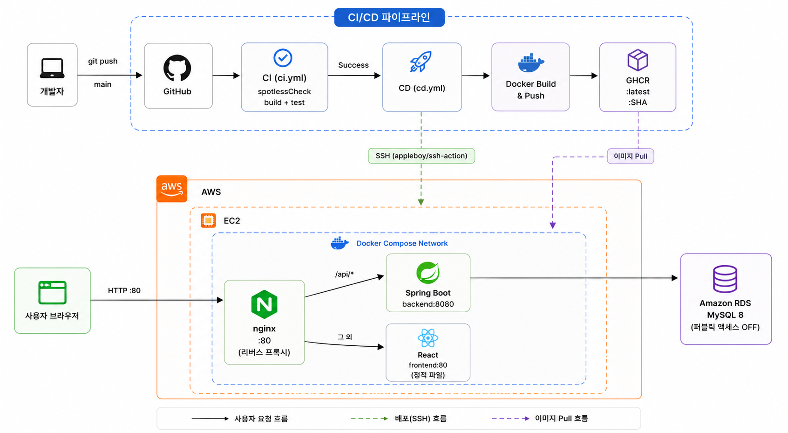
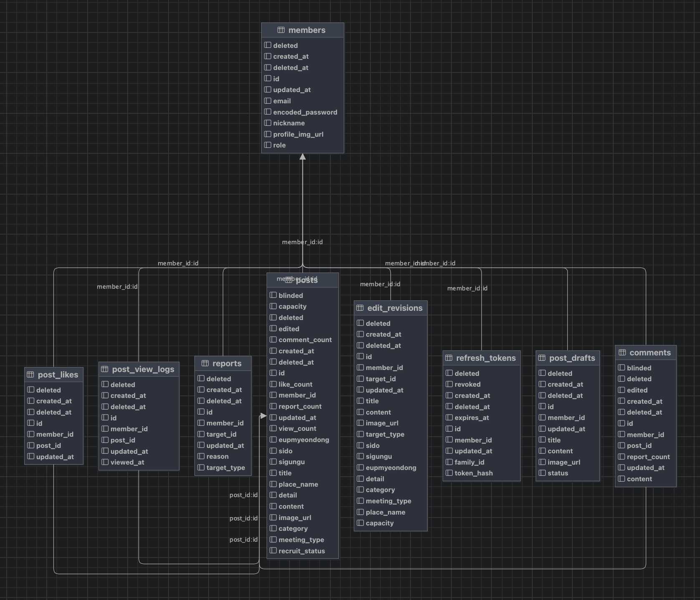

# Let's Meet!

**같이 할 사람들을 지금 만나다 — 소모임 모집 커뮤니티의 Back-end**

## 📌 소개

Spring Boot로 서버를 구현하고, MySQL(RDS)을 DB로 사용했습니다.

개발은 초기 프로젝트 설정부터, DB 설계, JWT 인증, 검색·레이트리밋 같은 고도화, CI/CD 배포까지 직접 구현했습니다.

Controller-Service-Repository(포트/어댑터) 패턴으로 구현했으며, 저장소는 포트 인터페이스에 JPA/InMemory 두 구현체를 두어 프로파일별로 배선을 바꿉니다.

| | |
|---|---|
| 개발 기간 | 2026-06-04 ~ (진행 중) |
| 개발 인원 | Back-end 1명 (본인) |
| Front-end | [저장소](https://github.com/100-hours-a-week/KTB_hoon_full_week7) |
| 시연 영상 | [링크](https://drive.google.com/file/d/1CeZ0o2Df8Yvj8D9igZE8vzPVAVCOf9M2/view?usp=drive_link) |

## 🛠 기술 스택

**Backend**

**Data & Search**

**Infra & CI/CD**

**Test & Tools**

## 🏗️ 서버 설계

### 인프라 구조

- EC2 한 대에서 `docker compose`로 nginx + frontend + backend 3개 컨테이너를 함께 운영합니다. 외부에 공개되는 포트는 nginx의 `80`뿐이며, backend/frontend는 내부 네트워크에서만 접근됩니다. DB는 별도 AWS RDS(MySQL 8) 인스턴스를 사용합니다.
- `main` push 하나만 트리거로 쓰며(PR 없음), CI가 성공한 커밋만 CD로 이어져 GHCR에 이미지를 올리고 EC2의 backend 컨테이너만 교체합니다. nginx/frontend는 이 파이프라인이 건드리지 않습니다.
- 연속 push 시 이전 배포는 취소하고 최신 커밋만 배포합니다(`concurrency: cancel-in-progress`).

## 🗄️ 데이터베이스 설계

### E-R Diagram

## 🚀 고도화

| # | 주제 | 성과 |
|---|---|---|
| 1 | RTR + Caffeine 블랙리스트 | RT 탈취·재사용 감지 시 세션 전체 폐기. 스케줄러 없이 per-entry TTL로 만료 처리 |
| 2 | 검색 : LIKE → FULLTEXT → OpenSearch | 운영 키워드 검색 34.83초 → 0.17~0.21초 (약 200배) |
| 3 | 날짜 범위 검색 + 복합 커서 | 6.39초 → 0.105초. 60페이지 깊이에서도 응답 시간 증가 없음 |
| 4 | Rate Limit sliding window | 고정 창 경계의 burst 통과 차단 |
| 5 | 색인 동기화 아웃박스 | 검색엔진 장애 중에도 색인 유실 0 — 복구 시 자동 따라잡기 |

### 1. RTR(Refresh Token Rotation) + Caffeine Cache

단순 JWT만 쓰면 AT가 탈취돼도 만료 전까지 무효화할 방법이 없고, RT가 탈취되면 만료될 때까지 계속 재사용당할 수 있습니다. 이를 막기 위해 RTR과 2종의 블랙리스트를 조합했습니다.

- **AT/RT 분리 전달** : AT는 `Authorization: Bearer` 헤더로, RT는 `HttpOnly` 쿠키(`Path=/api/v1`)로 전달합니다. RT는 원문이 아니라 해시(`token_hash`)로만 DB에 저장합니다.
- **family 단위 회전** : 로그인 시 `family_id`(UUID)를 발급하고, `/reissue`를 호출할 때마다 기존 RT를 `revoked=true`로 바꾼 뒤 같은 `family_id`로 새 RT를 발급합니다.
- **재사용 탐지** : 이미 회전되어 폐기된(`revoked=true`) RT가 다시 들어오면 탈취·재사용으로 간주해, 그 `family_id`에 속한 RT 전체를 폐기하고 이후 요청은 세션 블랙리스트로 즉시 차단합니다.
- **로그아웃** : AT는 `jti` 기준으로 토큰 블랙리스트에 등록해 남은 만료 시간 동안 즉시 무효화하고, RT는 family 전체를 폐기합니다. 로그아웃은 공개 엔드포인트라 토큰이 없거나 무효해도 항상 200으로 멱등하게 처리합니다.
- **Caffeine 캐시** : `jti` 기준 `TokenBlacklist`와 `familyId` 기준 `SessionBlacklist` 2종을 Caffeine 로컬 캐시로 구현했습니다. value로 토큰의 만료 epoch millis를 저장하고 `Expiry`를 커스텀 구현해 엔트리별 TTL을 실제 토큰 만료 시각에 정확히 맞췄습니다(`expireAfter`). 그 덕분에 별도 정리 스케줄러 없이 각 엔트리가 자기 만료 시점에 자동으로 제거됩니다. `maximumSize`와 사용량 모니터링(`CacheUsageMonitor`)으로 무한 증가도 방지합니다.
- **보안 원칙** : 인증/토큰 관련 실패는 원인(만료/서명불일치/재사용감지 등)에 관계없이 동일한 에러코드로 응답해 공격자가 실패 사유로 내부 상태를 추측하지 못하게 하고, 실제 원인은 서버 로그로만 남깁니다.

### 2. 검색 : LIKE → FULLTEXT(ngram) → OpenSearch

`LIKE '%keyword%'`는 선행 와일드카드 때문에 인덱스를 타지 못하고 매번 풀스캔이었습니다. `posts(title, content)`에 `WITH PARSER ngram` FULLTEXT 인덱스를 추가하고 `MATCH ... AGAINST(... IN BOOLEAN MODE)` 네이티브 쿼리로 전환했습니다.

- **phrase 검색으로 고정** : 키워드를 따옴표로 감싸 `LIKE`의 부분 문자열 매칭에 최대한 맞췄습니다. 따옴표가 없으면 ngram이 쪼갠 토큰들의 OR 검색이 됩니다(`등산모임` → `등산`/`산모`/`모임`). `NATURAL LANGUAGE MODE`는 phrase 구문이 없고 relevance 정렬을 전제해 커서 페이지네이션과 맞지 않아 배제했습니다.
- **키워드 정제** : 입력의 `"`를 제거해 phrase 구문이 중간에 닫히는 걸 막습니다(`sanitizeKeyword`). 따옴표 안에서는 boolean 연산자가 리터럴로 취급돼 연산자 주입도 함께 막힙니다. 다만 `ngram_token_size`가 2라 **1글자 키워드는 매치되지 않습니다** — `LIKE` 시절과 달라진 지점입니다.
- **쿼리 분기** : 키워드가 있을 때만 FULLTEXT 쿼리를 타고 없으면 기존 JPQL 목록 쿼리를 씁니다. 네이티브 쿼리에는 enum 매핑이 적용되지 않아 문자열로 변환해 넘기고, 동적 정렬을 실을 수 없어 `ORDER BY`는 쿼리 문자열에 고정했습니다.

그런데 운영 100만 건에서 다시 재보니 일부 키워드가 크게 느렸습니다. 아래는 운영과 동일한 쿼리(`SELECT p.* ... ORDER BY created_at DESC, id DESC LIMIT 11`)의 `EXPLAIN ANALYZE`와 실측입니다.

| 키워드 | 토큰 | 매치 | FT 노드 `rows` | 반환 | 실측 |
|---|---|---|---|---|---|
| `포핸드` | 2개 | 3,478 | 3,478 | 11 | 0.07 ~ 1.26초 |
| `복식` | 1개 | 49,685 | 49,685 | 11 | 22.97 ~ 30.50초 |
| `라켓` | 1개 | 69,237 | 69,237 | 11 | 32.61 ~ 41.94초 |
| `테니스` | 2개 | 41,679 | 41,679 | 11 | 33.19 ~ 51.80초 |
| 매치 없음 | — | 0 | 0 | 0 | 0.00초 |

**`rows`가 예외 없이 매치 전량입니다.** `Limit: 11`이 실행 계획 맨 위에 있는데도 아래로 전파되지 않습니다 — 11건만 필요한데 FULLTEXT가 매치 집합 전체를 만들어 넘깁니다. 매치 0건이 `rows=0`으로 즉시 끝나는 걸 보면, 느린 원인은 FULLTEXT 자체가 아니라 매치 건수입니다.

조건을 좁혀도 소용이 없습니다. `category` 필터를 붙이면 4만 건이 1.1만 건으로 줄지만, 필터는 FULLTEXT 뒤에서만 걸려서 FT 노드는 여전히 41,679행을 받고 시간도 34.20초로 같습니다(필터 없을 때 34.17초). 반대로 같은 테이블에서 키워드 대신 날짜 조건으로 11건을 뽑으면 인덱스가 11행만 읽고 즉시 끝납니다. 같은 11건인데 읽는 양이 3,800배 차이 납니다.

`LIMIT` 축소, 필터 추가, 행 페치 제거, `ORDER BY` 제거, 커서 범위 제한, 날짜 결합, `FORCE INDEX`(`ERROR 1191`)까지 MySQL 안에서 시도한 우회 일곱 가지가 전부 막혔습니다. 최신순을 버려도 `테니스`는 16~23초에서 멈추고, `SELECT p.*`를 `SELECT id`로 바꿔도 33~35초로 구분되지 않았습니다. `LIKE`로 되돌리는 것도 답이 아닙니다 — 매치가 없으면 94만 행을 훑어 13.13초로, 최악 케이스가 정반대로 옮겨갈 뿐입니다.

측정 과정에서도 두 번 크게 틀렸습니다. FULLTEXT 쿼리에서 `EXPLAIN ANALYZE`의 노드 시간이 실제와 최대 234배 어긋나는 걸 모르고 결론을 세웠고(노드 108ms, 실제 25.29초), 대조군을 단순하게 만들려고 `ORDER BY`를 빼고 측정한 결론을 정렬이 있는 운영 쿼리에 그대로 적용했습니다. 반복 측정을 하고 나서야 같은 쿼리가 22.97~30.50초로 흔들린다는 것을 알았고, 그 폭보다 작은 차이로 세웠던 모델(매치당 비용·토큰 배수)은 전부 접었습니다.

측정 기록과 폐기한 주장은 `docs/search/fulltext-search-experiment.md`에 남겼습니다. 옮길 수 있는 결론은 "매치가 많아지면 무너지고, MySQL 안에 막을 수단이 없다"까지였고, 그래서 **OpenSearch를 키워드 경로에만 붙여 해결했습니다.**

- **왜 여기서는 되는가** : 색인 자체를 최신순으로 정렬해두는 index sorting 덕에 위에서부터 걷다가 11건이 차면 멈춥니다. FULLTEXT에 없던 조기 종료가 생기는 겁니다. profile로 실측하면 매치 4만 건짜리 `테니스` 검색이 문서 **35건**만 읽고 끝납니다 — MySQL이 41,679건을 읽던 자리입니다.
- **구조** : 의존성 추가 없이 스프링 내장 `RestClient`로 붙였고, 색인은 최신순 id만 돌려주고 본문·작성자는 MySQL `JOIN FETCH`로 채웁니다(원본은 계속 MySQL). `(createdAt, id)` 복합 커서는 `search_after`로 그대로 이어집니다. OpenSearch 장애 시엔 FULLTEXT로 폴백해 검색이 죽는 대신 느려집니다. 색인 동기화는 처음엔 저장 직후 직접 호출이었는데, 유실 가능성이 있어 트랜잭셔널 아웃박스로 개선했습니다(5절).
- **운영 실측(같은 날, 같은 요청)** : `테니스` **34.83초 → 0.17~0.21초 (약 200배)**. 매치 6.9만 건 `라켓`도 0.15초 수준으로, 매치 건수와 응답 시간의 상관이 사라졌습니다. 검증 과정과 배포 기록(t3.small에 스왑·EBS 증설까지)은 `docs/search/opensearch-keyword-search.md`에 있습니다.

### 3. 날짜 범위 검색 : 정렬 축을 인덱스에 맞추고 커서를 복합으로

과거 구간 검색만 유독 느렸습니다. 같은 크기의 기간인데 얼마나 과거인지에 따라 50배 차이가 났습니다.

원인은 필터 축과 정렬 축의 불일치였습니다. 필터는 `created_at`, 정렬은 `id`였는데 MySQL은 접근 경로를 하나만 고를 수 있어 정렬이 공짜인 `PRIMARY`를 골랐고, 그 대가로 `created_at`을 행마다 확인했습니다. 11건을 반환하려고 777,756행을 읽고 있었습니다. 인덱스는 이미 있었습니다(`ALTER TABLE`이 `Duplicate key name`으로 실패해 확인) — 없어서가 아니라 옵티마이저에게 그걸 고를 이유를 준 적이 없었던 겁니다.

`ORDER BY created_at DESC, id DESC`로 바꾸자 `PRIMARY`의 유일한 장점이 사라지면서 읽은 행이 777,756에서 11로 줄었습니다. 그러자 이번엔 `WHERE id < :cursor`가 인덱스를 타지 못해 900,040행을 걸었고, 커서도 정렬과 같은 `(created_at, id)`로 맞춰 해결했습니다. 작성일이 완전히 같은 글이 다수 있어 `id`를 동점 처리로 함께 씁니다. `nextCursor`는 불투명 base64 문자열로 내보내 프론트가 형식에 의존하지 않게 했습니다.

| 요청 | 전 | 후 |
|---|---|---|
| `?from=2023-07-01&to=2023-08-01` (3년 전) | 6.39초 | 0.105초 |
| `?from=2026-08-01&to=2026-08-15` (최근) | 0.121초 | 0.081초 |

약 60배인데, 그보다 과거 구간과 최근 구간의 차이가 사라진 것이 핵심입니다. 커서도 60페이지까지 넘겨 깊이에 따른 증가가 없고(146.8ms → 42.2ms), 600건에 중복·누락이 없는 것을 확인했습니다.

한 줄로 줄이면 **정렬 축·필터 축·커서 축이 전부 같아야 인덱스가 일한다**는 것입니다. 전 과정은 `docs/search/date-range-search-troubleshooting.md`에 있습니다.

> 정렬 옵션(인기순·조회수순)을 늘리지 않은 것도 같은 이유입니다. 커서 페이지네이션은 정렬 키가 변하지 않는다는 전제로 동작하는데, `like_count`는 페이지를 넘기는 사이에 바뀌어 글이 누락되거나 중복될 수 있습니다.

고치고 나서 별개 문제를 하나 더 발견했습니다. 결과가 0건인 필터 조합은 `LIMIT`을 채우지 못해 끝까지 걷습니다. `meetingType`만 `OFFLINE`(740행 / 8ms)에서 `ONLINE`으로 바꾸자 100만 행 / 8,720ms가 됐습니다. 온라인 모임은 주소가 `null`이라 지역 조건과 함께 오면 결과가 나올 수 없는데, UI에서 두 번 클릭이면 만들어지는 조합입니다. 이번 변경이 만든 회귀는 아니고, 아직 해결하지 않았습니다.

### 4. 도배 방지 Rate Limit : Fixed Window → Sliding Window

`POST /posts`, 임시글 `publish` 같은 작성형 API에 분당 요청 수를 제한해 도배(무한 게시글 등록)를 막고 있는데, 초기 구현이었던 fixed window 방식에는 구조적인 허점이 있었습니다.

- **fixed window의 문제** : 1분을 고정 구간으로 나눠 구간별로 카운트하면, 구간 경계에서 burst가 통과합니다. 예를 들어 0:59에 3건, 1:00에 다시 3건을 몰아 보내면 단 2초 사이에 6건이 통과해 "분당 3건"이라는 정책의 의도를 벗어납니다.
- **sliding window로 전환** : 회원별로 최근 요청 타임스탬프를 `Deque`에 기록합니다. 요청이 올 때마다 현재 시각 기준 `windowMinutes` 이전 타임스탬프를 큐 앞에서 모두 제거하고, 남은 개수가 `limit` 이상이면 거부, 아니면 현재 시각을 큐에 추가하고 허용합니다. 항상 "지금 시점 기준 최근 N분"을 정확히 보므로 경계 burst가 사라집니다.
- **선언적 정책 부여** : `@RateLimited(limit, windowMinutes)` 애노테이션 + `RateLimitInterceptor`로 엔드포인트마다 다른 제한치를 선언적으로 붙일 수 있습니다(기본값 1분 3건). 카운터는 회원 단위로 공유됩니다.
- **한계** : 인메모리(`synchronized` + `HashMap`) 구현이라 인스턴스를 여러 대로 늘리면 인스턴스별로 카운터가 분리됩니다. 현재는 backend 컨테이너가 단일 인스턴스로 배포돼 있어 문제가 없지만, 스케일 아웃 시에는 Redis 등 공유 저장소로 옮겨야 합니다.

### 5. 색인 동기화 : 직접 호출 → 트랜잭셔널 아웃박스

OpenSearch 도입 초기의 색인 동기화는 글을 저장한 직후 같은 스레드에서 색인 HTTP를 직접 쏘고, 실패하면 로그만 남기는 방식이었습니다. 여기엔 구멍이 셋 있었습니다 — 색인 쓰기가 실패하면 그 글이 검색에서 **영구 누락**되고(유실), 색인 호출이 커밋 전에 실행되므로 색인 성공 후 트랜잭션이 롤백되면 DB에 없는 문서가 색인에 남으며(유령), 같은 글을 거의 동시에 수정하면 색인 도착 순서가 DB 커밋 순서와 어긋날 수 있습니다(순서 역전).

**트랜잭셔널 아웃박스**로 셋을 한 번에 닫았습니다.

- 글이 바뀌는 6곳(생성/발행/수정/마감/삭제/블라인드)이 `post_search_outbox` 테이블에 **post_id만** INSERT합니다. 게시글과 같은 트랜잭션이라 롤백되면 요청도 함께 사라집니다.
- 폴러(`@Scheduled` 1초)가 미처리 행을 집어 **처리 시점의 글 상태를 다시 읽어** 색인에 upsert/delete합니다. "무엇을 하라"를 저장하지 않으므로 순서가 꼬여도 항상 최종 상태로 수렴하고, 같은 글의 요청 여러 건은 한 번으로 접힙니다. 색인이 문서 전체를 덮어쓰는 upsert라 몇 번을 반영해도 안전합니다(at-least-once + 멱등).
- 실패한 행은 지수 백오프(1→300초)로 재시도하고, 20회를 넘기면 FAILED로 격리해 다음 행 진행을 막지 않습니다.

**장애 주입으로 검증했습니다.** OpenSearch를 내린 채 글을 쓰면 — 글쓰기는 정상(200), 아웃박스 행이 백오프로 재시도를 쌓다가, 컨테이너를 복구하자 다섯 번째 시도에 DONE으로 전환되고 검색에 노출됐습니다. 이전 구조에서는 영구 유실이던 시나리오입니다. 운영 반영 후에도 생성 +1초 검색 노출, 삭제 시 색인 제거까지 확인했습니다.

대가는 새 글의 검색 노출이 refresh 1초에서 폴링+refresh 최대 ~2초로 늘어난 것입니다. 전 과정은 `docs/search/search-index-outbox.md`에 있습니다.